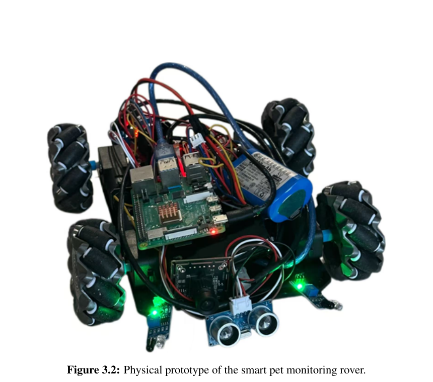
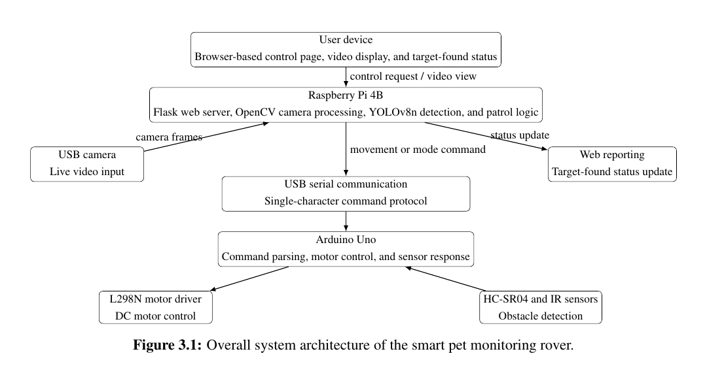
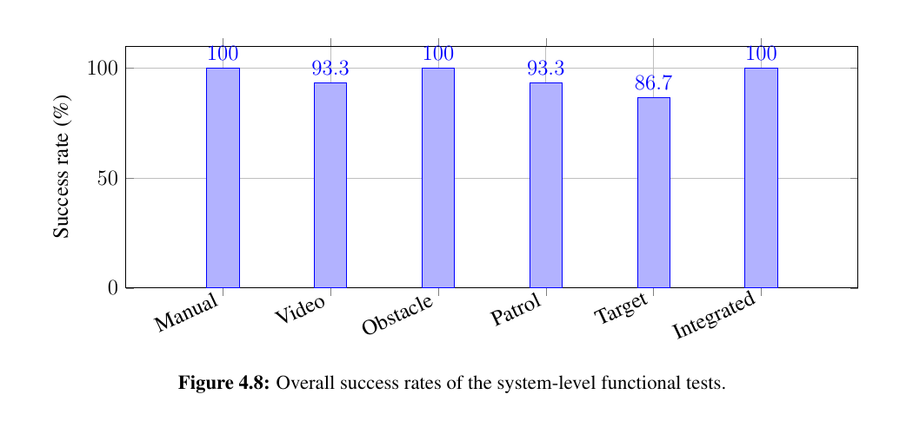

# Smart Pet Monitoring Rover

An indoor mobile-surveillance prototype that combines browser-based control, live video, basic obstacle response, automatic patrol behaviour, and YOLOv8n target detection on a Raspberry Pi-Arduino platform.

This repository contains the implementation and evaluation materials for a Bachelor of Engineering final-year project completed in May 2026 and awarded **74%**.



## Project overview

Fixed indoor cameras can leave blind areas when a pet moves between rooms or behind furniture. This project explores a low-cost mobile alternative: a four-wheel rover that streams video to a browser, accepts manual commands, performs a simple patrol sequence, responds to nearby obstacles, and reports when a target is detected.

The design deliberately separates high-level and low-level tasks:

- **Raspberry Pi 4B:** Flask web interface, OpenCV video pipeline, YOLOv8n inference, patrol logic, and status reporting.
- **Arduino Uno:** motor actuation and ultrasonic/infrared sensor response.
- **USB serial link:** single-character movement and mode commands between the two controllers.



## Key features

- Browser-based forward, backward, left, right, and stop controls
- Live USB-camera streaming through Flask and OpenCV
- Manual and automatic-patrol operating modes
- YOLOv8n detection using the pretrained COCO model
- Target-found status reporting and automatic stop behaviour
- Basic front and side obstacle response using one HC-SR04 and two IR sensors
- Configurable serial port, camera index, frame size, model path, target class, and detection interval

## Evaluated performance

The final prototype was evaluated under controlled indoor conditions. These figures describe the tested prototype, not production-level reliability.

| Function | Successful trials | Success rate |
|---|---:|---:|
| Manual control | 15/15 | 100% |
| Video monitoring | 14/15 | 93.3% |
| Obstacle response | 15/15 | 100% |
| Patrol logic | 14/15 | 93.3% |
| Target detection and reporting | 13/15 | 86.7% |
| Integrated end-to-end workflow | 5/5 | 100% |

Stable video trials averaged approximately **0.61 s** latency. One temporary freeze event was observed. Strong background lighting caused the two target-detection failures.



More detail is available in [`docs/test_results_summary.md`](docs/test_results_summary.md).

## Hardware

| Component | Role |
|---|---|
| Raspberry Pi 4B | Web server, video processing, detection, and patrol logic |
| Arduino Uno | Motor and sensor control |
| USB camera | Live video input |
| L298N motor driver | Dual-channel DC motor control |
| HC-SR04 ultrasonic sensor | Front obstacle sensing |
| Two IR sensors | Close-range side obstacle sensing |
| Four DC gear motors and chassis | Rover movement |
| 7.4 V and 5 V battery packs | Separate motor and Raspberry Pi supplies |

The full wiring map is documented in [`docs/pin_assignment.md`](docs/pin_assignment.md).

## Repository structure

```text
.
├── arduino_code/
│   └── rover_control/rover_control.ino
├── docs/
│   ├── pin_assignment.md
│   └── test_results_summary.md
├── figures/
│   ├── physical_prototype.png
│   ├── system_architecture.png
│   └── system_results.png
└── raspberry_pi_code/
    ├── app.py
    ├── camera.py
    ├── serial_comm.py
    ├── requirements.txt
    └── templates/index.html
```

## Raspberry Pi setup

The tested implementation targets a Raspberry Pi running Python 3 with a USB camera and an Arduino connected by USB.

```bash
git clone https://github.com/Range-997/Smart-Pet-Monitoring-Rover.git
cd Smart-Pet-Monitoring-Rover/raspberry_pi_code
python3 -m venv venv
source venv/bin/activate
pip install -r requirements.txt
python3 app.py
```

Open the interface from a device on the same local network:

```text
http://<raspberry-pi-ip>:5000
```

The first YOLO run may download `yolov8n.pt` automatically. To use a locally stored model, set `YOLO_MODEL` to its path.

### Configuration

| Environment variable | Default | Purpose |
|---|---|---|
| `SERIAL_PORT` | `/dev/ttyUSB0` | Arduino serial device |
| `CAMERA_INDEX` | `0` | OpenCV camera index |
| `FRAME_WIDTH` | `320` | Video-frame width |
| `FRAME_HEIGHT` | `240` | Video-frame height |
| `YOLO_MODEL` | `yolov8n.pt` | Model file or model name |
| `TARGET_CLASS` | `teddy bear` | COCO class used as the repeatable test target |
| `DETECT_EVERY_N_FRAMES` | `5` | Detection interval during automatic mode |

For example, if the Arduino is exposed as `/dev/ttyACM0`:

```bash
SERIAL_PORT=/dev/ttyACM0 python3 app.py
```

## Arduino setup

Open `arduino_code/rover_control/rover_control.ino` in the Arduino IDE, select Arduino Uno, and upload the sketch. The firmware and Raspberry Pi communicate at 9600 baud.

| Command | Meaning |
|---|---|
| `F` | Forward |
| `B` | Backward |
| `L` | Left turn |
| `R` | Right turn |
| `S` | Stop |
| `A` | Automatic mode |
| `M` | Manual mode |

## Scope and limitations

This is a university prototype for controlled indoor testing. It does **not** implement SLAM, localisation, map-based path planning, long-term autonomous navigation, real-pet behaviour recognition, production-grade authentication, or internet-facing security.

The pretrained YOLOv8n model was evaluated with a teddy bear as a repeatable pet-like target; no custom animal-recognition model was trained. Keep the Flask interface on a trusted local network and supervise the rover during operation.

## Author

**Yiran Yang** - system design, hardware/software integration, implementation, experimental evaluation, and thesis documentation.
